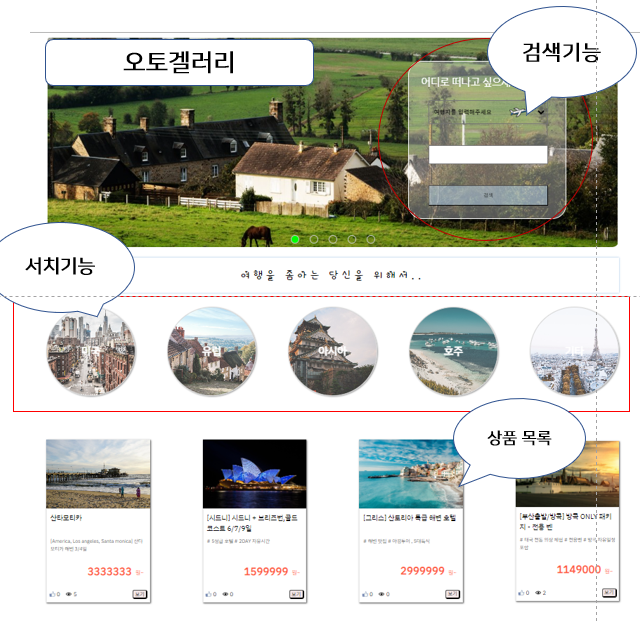
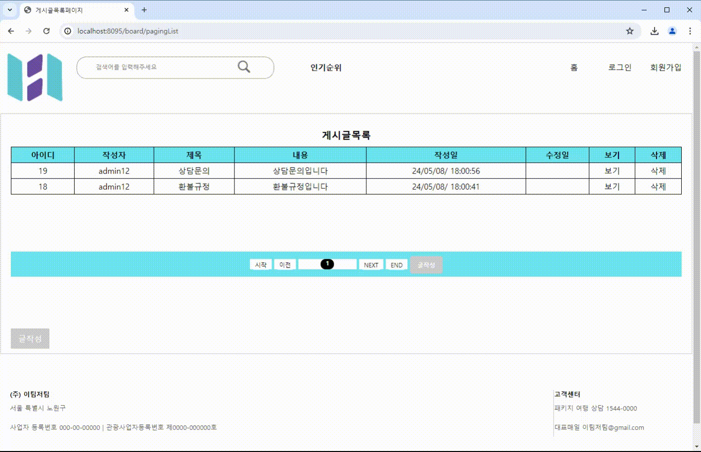

# Project1 ShoppingMall

### 1차 조별과제(5인) 쇼핑몰프로젝트

기간 24.04.10 - 24.05.10

배포:aws

### 개발환경

* 언어: java(jdk11), html/css, js, springboot, thymeleaf
* DB: MySQL

### 구현기능
* 회원관리 - 회원가입 로그인 회원정보수정/탈퇴 
* 관리자페이지
* 쇼핑몰 - 상품등록/구매, 장바구니, 구매한목록 
* 게시판 - QnA 자유게시판 작성/수정/삭제

### 담당
* 게시판 파트담당 (CRUD)
* 로그인시 작성가능 
* 작성글 작성/수정 -> 작성시간, 수정시간 나오게 구현 

